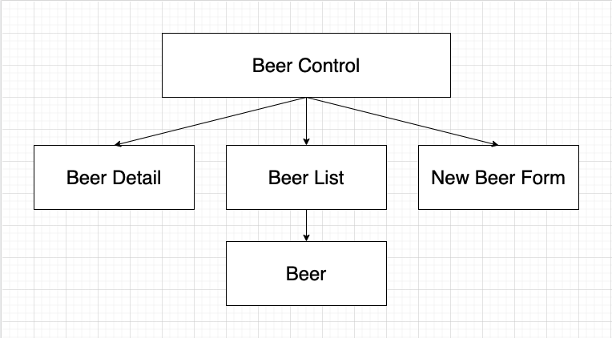

# _Tap-Room-Redux_
A React web app for creating, deleting, and updating different types of beer, using Redux to handle all state.

### _**Andy Lawson**_

[Epicodus](https://www.epicodus.com/) - [React](https://www.learnhowtoprogram.com/react) - [React with Redux](https://www.learnhowtoprogram.com/react/react-with-redux)

#### Date created: 04/30/2021

---

## Technologies Used

* _JavaScript_
* _JSX_
* _React_
* _Redux_
* _SASS_
* _draw.io_
* _git 2.30.0_

---

## User Stories

* As a user, I want to see a list/menu of all available kegs. For each keg, I want to see its name, brand, price and alcoholContent.
* As a user, I want to submit a form to add a new keg to a list.
As a user, I want to be able to click on a keg to see its detail page.
* As a user, I want to see how many pints are left in a keg. A full keg has roughly 124 pints.
* As a user, I want to be able to click a button next to a keg whenever I sell a pint of it. This should decrease the number of pints left by 1. Pints should not be able to go below 0.

## Component Diagram
Diagram showing parent and children components and how they will be structured in relation to one another:

---

## Setup/Installation

* To clone this directory, navigate in your terminal to the desired location of the project and run command `git clone https://github.com/andyL89/tap-room-redux.git`
* Navigate to top level of the directory with command `cd tap-room-redux`
* Run local server with command `npm run start`

---

## Editing Instructions

* To use Visual Studio Code to edit this project, follow install instructions [here](https://code.visualstudio.com/).
* To enable command `code`, open VS Code, click on View > Command Palette, type in "shell command", and click on "Shell Command: Install 'code' command in PATH"
* Now, from your terminal, in the project's top level directory, you can run command `code .` to open project in VS Code.

---

## Known Bugs

* Search Functionality not yet implemented.

---

## License

[MIT](LICENSE.txt)

---

## Contact Information

* _Contact Andy via [Email](mailto:alawson89@gmail.com) or [LinkedIn](https://www.linkedin.com/in/andrew-lawson-dev/), or check out his [Github](https://github.com/andyL89)._